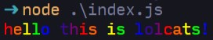

# lolcats

rainbows!

## usage

`npm i lolcats`

```javascript
const lol = require('lolcats');

lol('hello', 'this is lolcats!');
// or
lol('hello this is lolcats!');
// or
lol('hello', 'this', 'is', 'lolcats!');
```

these all return the same thing


